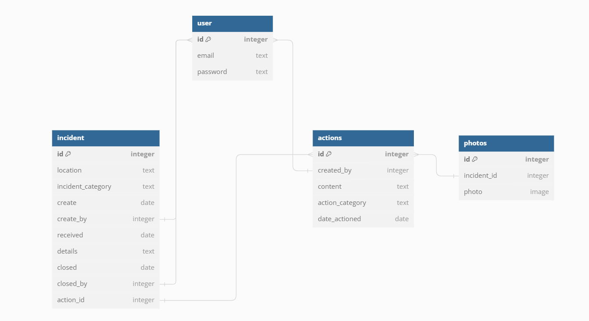

# DRF API

## Table of Contents
1. [Relationship Diagram](#relationship-diagram)
2. [Frameworks & Software](#frameworks--software)
3. [Libraries](#libraries)
4. [Testing](#testing)
5. [Manual Testing](#manual-testing)
6. [Deployment](#deployment)

## Relationship Diagram

Made with [dbdiagram.io](https://dbdiagram.io/home)

## Frameworks & Software

Python

Django Rest 

## Libraries

Please see requirements.txt file

## Testing

### Manual Testing

Testing was conducted via the frontend

- `/authusers/create/` create user -pass
- `/authuserstoken/login/` login user - pass
- `/authusers/token/refresh/` Refresh users authentication - pass
- `/incident/` list incidents - pass
- `/incident/id/` update/view incident - pass
- `/incident/create/` create incident - pass
- `/incident/delete/int/` delete incident - pass
- `/actions/list/<id>/` list all actions linked to incident - pass
- `/actions/<id>/` display/update action - pass
- `/actions/delete/<id>/` delete action - pass
- `/actions/create/` create action - pass
- `/actions/photo/delete/<id>/` delete action - pass
- `/actions/photo/<id>/` list photos linked to action - pass
- `/actions/photo/create/` create photo - pass

### Bugs

I have not found any bug at this moment.

## Deployment
## API Deployment

Heroku used as the debloyment service.

In order to deploy this app I went to Heroku https:heroku.com/apps

1. Create a New App

    Click new and create new app.

2. Name and Region

    Choose a name and the region

3. Deploy Tab

    Click Deploy Tab

4. Connect to Github

    Connect to Github so we can choose our repository to deploy.
Search repository by name

5. Configure environment

    Go to the settings tab, reveal config vars and enter the following 

* CLOUDINARY_URL: 'Your API URL'
* CORS_ALLOWED_ORIGINS: 'Hosts you want to allow access to the api'
* DATABASE_URL: 'Your database'
* DEBUG_VALUE: 'False'
* DISABLE_COLLECTSTATIC: '1'
* SECRET_KEY: 'Your Secret key'

6. Deployment
    Go back to the deploy tab scroll down and click deploy

## Credits
I would like to give credit to [techwithtim](https://github.com/techwithtim/Django-React-Full-Stack-App) for his repo on how he manages JWP token authentication with between Django and React